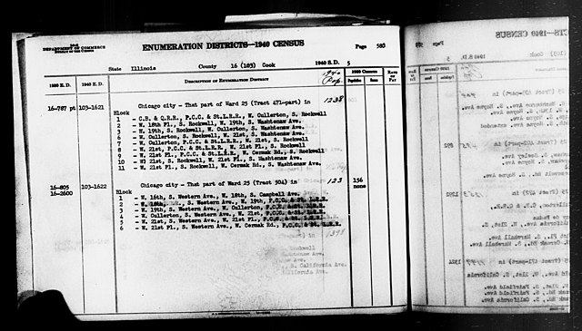
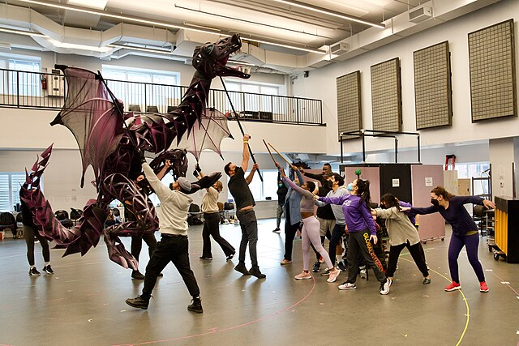

## Building checks for R functions --- A nomenclature


<!-- 
<a href="https://arxiv.org/abs/2210.07278" target="_blank">arXiv Preprint</a> | <a href="https://github.com/marvinschmitt/MetaUncertaintyPaper" target="_blank">Code</a><br> -->

Lorem ipsum et caetera

----

## Tidy Tuesday



I had done one or two TidyTuesdays last year. I expect to be doing much more in the coming months, in R, Python and most likely D3 (using Quarto).

Details here: []

```{=html}
<div  style="margin: 30px; text-align: center;">
<a class="btn btn-primary" href="TidyTuesdays" role="button" target="_blank" style="padding: 15px 30px;">A good example available here</a>
</div>
```
